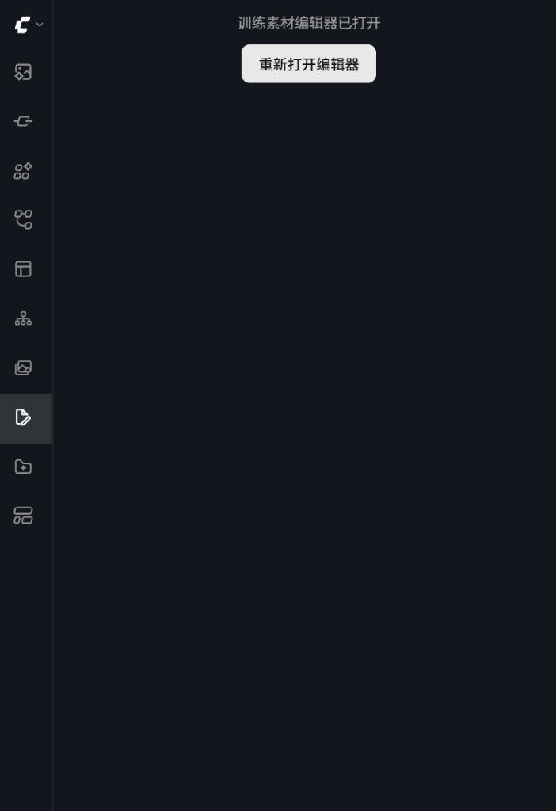

# ComfyUI Training Data Editor

ComfyUI 训练素材编辑器 —— 浏览、编辑图像模型训练素材（图像 + 文本配对文件）。

**标准 ComfyUI 插件**：克隆到 `custom_nodes` 目录即可使用，**无需修改 ComfyUI 核心代码**。

## 界面预览

### 侧边栏入口

点击 ComfyUI 左侧边栏的 **训练素材编辑器** 图标（文档+线条样式）即可打开插件。首次打开后会弹出独立编辑窗口；若窗口被关闭，可在主界面点击 **重新打开编辑器** 再次唤起。



### 主编辑界面

编辑器以弹窗形式运行，主要区域说明如下：

| 区域 | 说明 |
|------|------|
| 目录路径 | 输入或拖拽训练素材文件夹路径，点击 **扫描目录** 加载图像与配对文本 |
| 批量翻译 | 选择源语言 / 目标语言，对全部已加载文本一键翻译（支持百度 / Google） |
| 批量文本编辑 | 输入字符串后，可 **头部追加**、**尾部追加** 或 **删除字符串**，对所有文本文件生效 |
| 图像网格 | 扫描完成后显示缩略图卡片，点击可在右侧编辑对应文本 |
| 设置 | 配置翻译引擎、百度 API 密钥等 |


## 功能

- 图像-文本配对浏览（`.txt` / `.json` / `.yaml` / `.csv`）
- 缩略图网格、分页加载、懒加载
- 单条文本编辑、保存、查看原图（灯箱）
- 单条 / 批量翻译（百度 + Google）
- 批量文本编辑：头部追加、尾部追加、删除指定字符串
- 左侧边栏图标入口，独立弹窗操作界面

## 环境要求

- ComfyUI（新版前端，带左侧边栏菜单）
- Python 3.9+
- 网络连接（翻译功能）

> `aiohttp` 由 ComfyUI 自带，无需单独安装。

## 安装

### 方式一：Git 克隆（推荐）

```bash
cd ComfyUI/custom_nodes
git clone https://github.com/zy-akuo/ComfyUI-TrainingDataEditor.git
cd ComfyUI-TrainingDataEditor
pip install -r requirements.txt
```

### 方式二：ComfyUI Manager

在 Manager 中搜索 **Training Data Editor** 安装（发布到仓库后）。

### 方式三：手动下载

将本仓库解压到 `ComfyUI/custom_nodes/ComfyUI-TrainingDataEditor/`。

安装依赖后 **重启 ComfyUI**。

## 使用

1. 启动 ComfyUI，点击左侧边栏 **训练素材编辑器** 图标
2. 在弹窗顶部的路径栏输入训练素材目录（例如 `D:\datasets\my_lora`），点击 **扫描目录**
3. 扫描完成后，下方网格会显示所有图像缩略图及其配对状态
4. 点击任意缩略图卡片，在右侧文本区查看 / 编辑 caption，按 `Ctrl+S` 保存
5. 需要统一添加 tag 时，在 **批量文本编辑** 栏输入内容（如 `masterpiece, best quality,`），选择 **头部追加** 或 **尾部追加**
6. 需要翻译时，在右上角选择语言，点击 **批量翻译** 处理全部文本

> 若编辑窗口意外关闭，回到 ComfyUI 主界面，点击 **重新打开编辑器** 即可恢复，无需重新扫描目录。

## 翻译配置

在弹窗内点击 **设置**：

| 引擎 | 说明 |
|------|------|
| 百度翻译 | 需填写 [百度翻译 API](https://fanyi-api.baidu.com/) 的 AppID 和 AppKey |
| Google 翻译 | 免费使用，无需配置（需能访问 Google） |

配置保存在插件目录下的 `config.json`（首次保存后自动生成，已加入 `.gitignore`）。

## 项目结构

```
ComfyUI-TrainingDataEditor/
├── __init__.py           # 插件入口（注册路由与前端）
├── server.py             # 后端 API
├── config_manager.py     # 配置管理
├── requirements.txt
├── pyproject.toml        # ComfyUI Manager 兼容
├── docs/images/          # README 截图
├── js/                   # 前端扩展
└── _cache/               # 缩略图缓存（运行时自动生成）
```

## API 端点

| 端点 | 方法 | 功能 |
|------|------|------|
| `/training-data/scan` | POST | 扫描目录 |
| `/training-data/thumbnail` | GET | 缩略图 |
| `/training-data/image` | GET | 原图 |
| `/training-data/text` | GET/PUT | 读写文本 |
| `/training-data/translate` | POST | 翻译 |
| `/training-data/batch-translate` | POST | 批量翻译 |
| `/training-data/batch-text-edit` | POST | 批量追加/删除 |
| `/training-data/batch-save` | POST | 批量保存 |
| `/training-data/config` | GET/PUT | 配置 |

## 快捷键

- `Ctrl+S`：保存当前文本
- `Esc`：关闭编辑器 / 弹窗 / 原图灯箱

## 开源说明

- 本插件完全独立，所有代码在 `custom_nodes/ComfyUI-TrainingDataEditor/` 内
- 通过 ComfyUI 公开 API 集成：`PromptServer`、`WEB_DIRECTORY`、`app.registerExtension`
- 不 patch、不 fork ComfyUI 源码
- MIT License

## 许可证

MIT License
